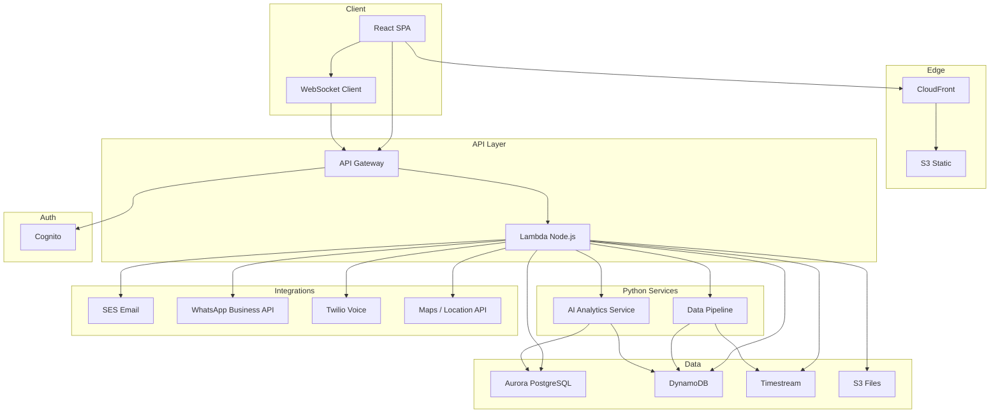

# WattOS Portal — Technical Documentation & Architecture

**Prepared by:** TechPotato Softwares LLP  
**Prepared for:** OSG Oriana India  
**Document Version:** 1.0  
**Date:** January 2026

---

## 1. System Overview

WattOS is a **cloud-based Solar Assets Performance Monitoring Suite** that provides:

- **Real-time monitoring** of solar installations (dashboards, KPIs, charts, live alerts).
- **Operations:** Alarms, tickets, work orders, activity logging (maintenance, cleaning, meter reading, site visits), billing, reports, and custom graphs.
- **Analytics:** Real-time analytics (live view, WebSockets), AI-powered performance insights and recommendations.
- **HR (Workforce):** Attendance, live location tracking, leave, payroll view.
- **Warranty management:** Equipment registry, warranty dates, claims.
- **Integrations:** Email, WhatsApp, voice/call, live location; optional analytics tools.
- **UX:** Dark mode, profile modal, global search, print, export to CSV, form templates, upload photo, save as draft.

The system is built for **multi-tenant** usage (sites, users, roles) with **RBAC**, and is hosted on **AWS** with a **multi-language** setup: **Node.js** for the main API and **Python** for data pipelines and AI/analytics.

---

## 2. Project Complexity (Technical View)

| Dimension | Complexity | Description |
|-----------|------------|-------------|
| **Scale** | High | 119+ screens, 134+ APIs, 12+ modules; time-series data (inverters, meters, site snapshots); multi-tenant (sites, users, roles). |
| **Real-time** | High | WebSocket-based live dashboards and alerts; 5-minute (and hourly) aggregation; near real-time data refresh. Requires low-latency pipeline and scalable WebSocket handling. |
| **Data pipeline** | High | Ingestion (MQTT/HTTP), validation, transformation, aggregation (5-min, hourly, daily), storage (DynamoDB/Timestream), and alert evaluation. Python-based pipeline with EventBridge/Lambda or containers. |
| **AI / ML** | High | Python AI service for performance insights, anomaly detection, and recommendations; integration with Node API via HTTP/events; optional LLM (Bedrock/OpenAI). Requires clear API contracts and deployment (Lambda or ECS). |
| **Integrations** | High | Email (SES), WhatsApp Business API, Twilio (voice/call), Maps/location API. Each has rate limits, retries, and error handling; secrets in AWS Secrets Manager. |
| **Security & RBAC** | High | Cognito (JWT), fine-grained RBAC (site access, role-based features), data isolation per tenant. Enforced in API Gateway, Lambda, and frontend routes. |
| **Multi-language** | Medium | Node.js (API, frontend build) and Python (data pipeline, AI service). API contracts (OpenAPI), events (EventBridge), and separate deployment paths (Lambda/ECS). |

---

## 3. Architecture Diagram

---

## 4. Technology Stack

| Layer | Technology |
|-------|------------|
| **Frontend** | React 18, TypeScript, Tailwind CSS, Recharts, React Query, WebSocket client (e.g. socket.io-client or native) |
| **State management** | Zustand / Redux Toolkit |
| **API** | AWS API Gateway (HTTP API) + AWS Lambda (Node.js 20) |
| **Authentication** | Amazon Cognito (User Pools + RBAC) |
| **Platform database** | Amazon Aurora PostgreSQL Serverless v2 |
| **Time-series data** | Amazon DynamoDB (on-demand) + Amazon Timestream (optional for graphs) |
| **File storage** | Amazon S3 (documents, images, reports) |
| **Notifications** | Amazon EventBridge, SES, SNS |
| **PDF generation** | Lambda + Puppeteer / PDFKit |
| **Hosting** | Amazon S3 + CloudFront |
| **Data pipeline** | **Python** (Lambda or container): Pandas, Apache Airflow (optional), MQTT/HTTP ingestion, aggregation jobs |
| **AI / analytics** | **Python** service (FastAPI/Flask or Lambda): scikit-learn, LangChain (optional for LLM), AWS Bedrock / SageMaker SDK; or OpenAI API for insights |
| **Integrations** | SES (email), WhatsApp Business API, Twilio (voice/call), Maps/location API (e.g. Google Maps / Mapbox) |
| **Infrastructure** | AWS CDK (TypeScript), Docker for Python services (ECS/Fargate if needed) |
| **CI/CD** | GitHub Actions + AWS CodePipeline |

### 4.1 Python libraries (data & AI)

| Purpose | Library / service |
|--------|-------------------|
| ETL / data processing | Pandas, NumPy |
| Scheduling (optional) | Apache Airflow, or Lambda + EventBridge |
| ML / analytics | scikit-learn, NumPy, SciPy |
| LLM / AI insights (optional) | LangChain, OpenAI API, or AWS Bedrock |
| API (Python service) | FastAPI or Flask |
| AWS | boto3, AWS SDK for Python |

---

## 5. Multi-Programming Language and AI — Repository Organization (High-Level)

### 5.1 Approach

- **Backend API (main):** Implemented in **Node.js** (Lambda + API Gateway). Handles auth, CRUD, file upload, notifications, and orchestration. Exposes REST (and WebSocket) to the frontend.
- **Data pipeline:** Implemented in **Python**. Responsible for ingestion (MQTT/HTTP), validation, transformation, aggregation (5-min, hourly, daily), and writing to DynamoDB/Timestream. Can run as **Python Lambdas** triggered by EventBridge/Kinesis, or as a **containerized service** (ECS/Fargate) for long-running jobs.
- **AI / analytics service:** Implemented in **Python**. Provides performance insights, anomaly detection, and recommendations. Exposed via **REST API** (FastAPI/Flask) or **Lambda (Python)**. The Node.js API invokes it over **HTTP** (internal API) or via **events** (EventBridge); no shared repository folder structure required here — only clear **API contracts** (OpenAPI) and **event schemas**.

### 5.2 Tech for multi-language

- **API contracts:** OpenAPI (Swagger) for Node ↔ Python AI service; request/response and error formats agreed up front.
- **Events:** EventBridge (or SNS/SQS) for async triggers (e.g. “data batch ready” → Python aggregation; “alarm raised” → Node notification + optional AI check).
- **Deployment:** Node.js Lambdas and frontend via existing CI/CD; Python Lambdas or Python containers via the same pipeline (e.g. build Python Docker image and deploy to ECR + ECS/Fargate, or deploy Python Lambda from a separate build step).
- **No folder structure** is specified here; organization can be **monorepo** (e.g. `backend-node`, `data-pipeline-python`, `ai-service-python`) or **separate repos** per service, with shared contract repos or docs.

### 5.3 How the app invokes AI

- **Frontend** calls **Node.js API** (e.g. “get performance insights for site X”).
- **Node.js API** calls **Python AI service** via HTTP (internal ALB or API Gateway private integration) or invokes a **Python Lambda** with payload.
- **Python AI service** reads from Aurora/DynamoDB (or receives summarized data), runs model or LLM logic, returns insights/recommendations.
- **Node.js API** returns the result to the frontend. Caching (e.g. ElastiCache) can sit in front of the AI service for repeated queries.

---

## 6. Integrations

| Integration | Purpose | High-level approach |
|-------------|---------|----------------------|
| **Email** | Notifications, alerts, invoices | Amazon SES; Lambda sends templates |
| **WhatsApp** | Alerts, support, notifications | WhatsApp Business API; Lambda or backend calls API |
| **Voice / call** | Click-to-call, support | Twilio (or similar); backend generates links/tokens |
| **Live location** | Workforce tracking | Maps API (e.g. Google Maps / Mapbox) + device/location API; store in DB, expose via Node API |
| **WebSockets** | Real-time dashboards, live alerts | API Gateway WebSocket API or AppSync; Lambda handles connect/message/disconnect |
| **Analytics tools** | Optional third-party analytics | REST APIs from backend; documented per tool |

---

## 7. Module-Wise Technical Effort

| Module | Screens (approx) | Backend (person-days) | Frontend (person-days) | QA (person-days) | Total |
|--------|-------------------|------------------------|------------------------|------------------|-------|
| Auth & RBAC | 2 | 14 | 10 | 5 | 29 |
| Dashboards | 4 | 16 | 22 | 8 | 46 |
| Sites | 4 | 10 | 12 | 5 | 27 |
| Alarms | 5 | 16 | 18 | 7 | 41 |
| Tickets | 6 | 18 | 20 | 8 | 46 |
| Work Orders | 5 | 14 | 16 | 6 | 36 |
| Activity Log | 8 | 22 | 24 | 10 | 56 |
| Billing | 6 | 22 | 18 | 8 | 48 |
| Reports | 5 | 18 | 14 | 6 | 38 |
| Graphs | 4 | 16 | 18 | 6 | 40 |
| Analytics (real-time + AI) | 4 | 24 | 18 | 8 | 50 |
| Workforce (HR) | 5 | 16 | 16 | 6 | 38 |
| Warranties | 4 | 12 | 12 | 5 | 29 |
| Customers | 2 | 6 | 8 | 3 | 17 |
| Components | 3 | 10 | 10 | 4 | 24 |
| Settings | 7 | 20 | 22 | 8 | 50 |
| Data pipeline (Python) | — | 40 | — | 8 | 48 |
| AI service (Python) | — | 20 | — | 5 | 25 |
| Infrastructure & DevOps | — | 22 | — | 6 | 28 |
| Integration & E2E testing | — | 12 | 14 | 16 | 42 |
| **Total** | **~70+** | **~330** | **~260** | **~130** | **~720** |

*Screens count includes main screens and key modals; backend/QA include Python data pipeline and AI service.*

---

## 7.1 Cost Justification (Man-Days & Per-Hour Rates)

The total project cost (**₹66,28,000**) is derived from **760 person-days** of effort and the following **team composition and rates** (8 hours per day):

| Role | Count | Rate (₹/hr) | Cost per person-day (8 hr) | Person-days | Total cost (INR) |
|------|-------|-------------|----------------------------|-------------|------------------|
| **Architect** (incl. DevOps) | 1 | 2,000 | 16,000 | 50 | 8,00,000 |
| **AI engineer** | 1 | 1,500 | 12,000 | 63 | 7,56,000 |
| **Full-stack developer** | 2 | 1,000 | 8,000 | 517 (combined) | 41,36,000 |
| **QA engineer** | 1 | 900 | 7,200 | 130 | 9,36,000 |
| **Total** | **5** | — | — | **760** | **66,28,000** |

**Role allocation:**

- **Architect:** Solution design, infrastructure (AWS CDK), DevOps/CI-CD, API and integration design, technical reviews. Engaged across all three phases (50 days total).
- **AI engineer:** Engaged from **Phase 2 only**. Phase 2: data pipeline (Python), ingestion, aggregation (20 days). Phase 3: AI analytics service (Python), ML/insights, integration (43 days). Total 63 days.
- **Full-stack developers (2):** Backend (Node.js/Lambda, Aurora, DynamoDB, S3), frontend (React), all application modules and integrations. 517 person-days combined across phases.
- **QA engineer:** Test strategy, test cases, automation (e.g. Playwright), API testing, UAT support, performance and security testing. 130 person-days across phases.

**Phase-wise cost breakdown (same rates):**

| Phase | Architect | AI engineer | Full-stack | QA | Phase total (INR) |
|-------|-----------|-------------|------------|-----|-------------------|
| Phase 1 — Foundation & core | 20 days | 0 days | 180 days | 35 days | **20,12,000** |
| Phase 2 — Operations | 15 days | 20 days | 220 days | 52 days | **26,14,400** |
| Phase 3 — Analytics, HR, AI & experience | 15 days | 43 days | 117 days | 43 days | **20,01,600** |
| **Total** | **50** | **63** | **517** | **130** | **66,28,000** |

---

## 8. Technical Challenges and Resolution (Latest Tech)

| Challenge | Description | How we resolve it (latest tech) |
|-----------|-------------|----------------------------------|
| **Real-time data at scale** | Live dashboards and alerts need low-latency data; high write/read volume for time-series. | **WebSocket** (API Gateway WebSocket API or AppSync) for push; **DynamoDB** (on-demand) or **Timestream** for time-series; **Lambda** + EventBridge for sub-minute aggregation; **caching** (ElastiCache or DynamoDB DAX) for hot paths. |
| **Data pipeline reliability** | Ingestion from devices/APIs must be validated, deduplicated, and aggregated without loss. | **Python** pipeline (Lambda or ECS) with **schema validation** (e.g. Pydantic); **idempotency** keys; **EventBridge**/Kinesis for ordering; **dead-letter queues** and retries; **data quality** checks and monitoring (CloudWatch). |
| **AI service integration** | Node API must call Python AI service with clear contracts and scalable inference. | **OpenAPI** contract between Node and Python; **REST** or **Lambda-to-Lambda** invocation; **AWS Bedrock** or **SageMaker** for managed ML; **LangChain** (optional) for LLM flows; **caching** for repeated queries; Python deployed as **Lambda** or **ECS/Fargate** for heavier models. |
| **Multi-tenant security** | Data and access must be isolated per site/tenant; RBAC at API and UI level. | **Cognito** (User Pools + groups/attributes) for identity; **JWT** claims for site/role; **row-level** or **query-level** filtering in Lambda (tenant_id/site_id); **API Gateway** authorizer; **frontend** route guards and permission checks. |
| **Integrations (WhatsApp, call, email)** | Third-party APIs have rate limits, failures, and compliance requirements. | **Secrets Manager** for API keys; **retry** with backoff; **queues** (SQS) for async send; **SES** for email (templates, bounces); **WhatsApp Business API** and **Twilio** with webhooks and status handling; **circuit breaker** pattern for external calls. |
| **Live location tracking** | Workforce location must be captured, stored, and displayed with privacy and scale. | **Maps API** (Google Maps / Mapbox) for display; **device/location API** or mobile SDK for coordinates; **Aurora** or DynamoDB for location history; **geohashing** for spatial queries if needed; **privacy** (consent, retention policy). |
| **Frontend performance (119 screens)** | Large SPA with many modules and real-time updates must stay fast. | **React 18** (concurrent features, lazy loading); **code splitting** per route/module; **React Query** for caching and background refresh; **Tailwind** for small CSS; **Recharts** with virtualization for large datasets; **WebSocket** for live data only where needed. |
| **DevOps and deployment** | Multi-service (Node, Python, frontend) with multiple environments. | **AWS CDK** (TypeScript) for infra as code; **GitHub Actions** or **CodePipeline** for CI/CD; **Lambda** and **S3/CloudFront** for serverless; **ECR + ECS/Fargate** for Python containers if used; **parameter store** or **Secrets Manager** for config. |

---

## 9. API Inventory (Estimated)

| Module | Endpoints (approx) |
|--------|---------------------|
| Auth | 5 |
| Sites | 8 |
| Dashboards | 10 |
| Alarms | 12 |
| Tickets | 10 |
| Work Orders | 8 |
| Site Activities | 14 |
| Billing | 10 |
| Reports | 8 |
| Graphs | 6 |
| Analytics (incl. AI) | 8 |
| Workforce | 10 |
| Warranties | 6 |
| Customers | 4 |
| Components | 5 |
| Settings | 12 |
| **Total** | **~134** |

*Includes export CSV, print, file upload, templates, save draft, notifications, WhatsApp/call, location, WebSocket handshake, and AI analytics.*

---

## 10. Database and Data Model

- **Aurora PostgreSQL:** Platform data (users, roles, sites, alarms, tickets, tasks, activities, billing, HR, warranties, customers, components, settings). ~40+ tables.
- **DynamoDB:** Time-series and cache (e.g. 5-min site snapshots, inverter readings, dashboard cache). Partition key by site/time.
- **Timestream (optional):** Long-term time-series for graphs and analytics.
- **S3:** Documents, images, reports, exports (CSV/PDF). Lifecycle policies for archival.

*Detailed schema to be finalized in implementation phase.*

---

## 11. Security and Deployment

- **HTTPS only** (CloudFront + API Gateway).
- **Authentication:** Cognito (JWT); RBAC enforced in Node.js API and frontend routes.
- **Secrets:** AWS Secrets Manager (DB, API keys, WhatsApp, Twilio, etc.).
- **Network:** API and Python services in VPC; private subnets for DB and internal services.
- **Single region:** ap-south-1 (Mumbai) for initial deployment.
- **CI/CD:** GitHub Actions (or CodePipeline) for build, test, deploy (Lambda, S3, CloudFront, ECS if used). Branch strategy: main → production; develop → staging.

---

*This document is part of the WattOS technical set. For stakeholder pricing and phased launch, see the Stakeholder Analysis and Phased Launch documents.*

**© 2026 TechPotato Softwares LLP. All rights reserved.**
